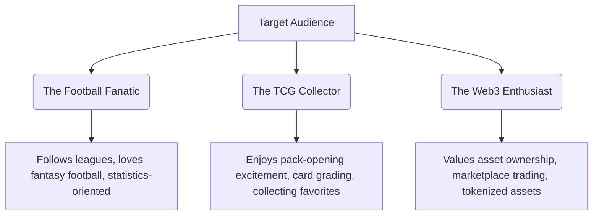

# Game Design Document (GDD)

**Project Name:** kickIt
**Version:** 1.0
**Author:** Muhammad Izzdaniel
**Last Updated:** 19 July 2026

---

# 1. Overview & Vision

## Elevator Pitch
**kickIt** is a Web3-enabled 5-a-side fantasy football collectible card game (TCG) that merges the strategic depth of fantasy sports with the true digital ownership of blockchain technology. Players collect, upgrade, and trade digital player cards representing real-world football stars. By forming tactical 5-a-side squads, users compete in weekly tournaments where performance is determined by real-time data from professional football matches. With true asset ownership, users can trade cards on an open marketplace, open packs to discover rare players, and climb the global ranks to earn valuable rewards.

## Core Value Proposition
- **True Ownership:** Every collectible player card is a digital asset (NFT) on the Polygon blockchain, allowing players to trade, sell, or hold their collection securely.
- **Data-Driven Gameplay:** Scoring is directly linked to real-life performances of professional players, creating a bridge between live football fandom and interactive gaming.
- **Accessible Strategy:** A 5-a-side format makes team building quick, tactical, and easy to understand compared to traditional 11-a-side fantasy sports.
- **Fair Economy:** A dual-currency system (Coins & Gems) ensures that free-to-play users can progress by playing the game, while premium players can accelerate their collection through packs and the marketplace.

---

# 2. Target Audience

We target a broad demographic ranging from **18 to 60 years old**, focusing on three main player personas:



- **The Football Fanatic:** Avid sports followers who play fantasy leagues, analyze player statistics, and want a more interactive way to leverage their football knowledge.
- **The TCG Collector:** Gamers who love the thrill of pack openings, chasing legendary cards, completing sets, and managing digital collections.
- **The Web3 Enthusiast:** Tech-savvy users attracted by true digital ownership, decentralized marketplaces, and play-and-earn ecosystems.

---

# 3. Core Gameplay Loop

The game loop is structured around a continuous daily and weekly cycle:

```
+-------------------------------------------------------------+
|                                                             |
|                      1. LOGIN & RECLAIM                     |
|                   Claim Daily Logins & Quests               |
|                                                             |
+------------------------------+------------------------------+
                               |
                               v
+-------------------------------------------------------------+
|                                                             |
|                      2. PACK & COLLECTION                   |
|              Open Packs, Trade, and Manage Club             |
|                                                             |
+------------------------------+------------------------------+
                               |
                               v
+-------------------------------------------------------------+
|                                                             |
|                      3. SQUAD SELECTION                     |
|           Select 5 Starters + 2 Subs under Rating Cap       |
|                                                             |
+------------------------------+------------------------------+
                               |
                               v
+-------------------------------------------------------------+
|                                                             |
|                      4. WEEKLY TOURNAMENT                   |
|             Lock Squads and Watch Real-World Matches        |
|                                                             |
+------------------------------+------------------------------+
                               |
                               v
+-------------------------------------------------------------+
|                                                             |
|                      5. LIVE SCORING                        |
|            Real-world performance maps to In-Game Points    |
|                                                             |
+------------------------------+------------------------------+
                               |
                               v
+-------------------------------------------------------------+
|                                                             |
|                      6. CLAIM REWARDS                       |
|           Earn Coins, Gems, Pack Bundles, & XP              |
|                                                             |
+------------------------------+------------------------------+
                               |
                               +---- (Repeat the cycle) ------+
```

1. **Login & Reclaim:** Players check in daily to claim free coins, complete daily missions, and check current market deals.
2. **Collect & Trade:** Players open card packs using in-game Coins or Premium Gems, or buy specific player cards from other users in the Marketplace.
3. **Build & Optimize:** Players design tactical squads for upcoming tournaments, matching player positions to chosen formations while staying within the **Tournament Rating Cap**.
4. **Enter & Lock:** Squads are submitted to weekly tournaments before the real-world gameweek locks.
5. **Real-world Scoring:** Real-world match statistics are processed and converted into fantasy points in real-time.
6. **Claim & Upgrade:** Tournaments conclude, distributing rewards. Players use winnings to upgrade cards or purchase premium packs, restarting the loop.

---

# 4. Card System

Player cards are the central assets in **kickIt**. Each card represents a real-world professional footballer.

## Card Anatomy & Metadata
- **Player Name & Photo:** Visual representation of the footballer.
- **Current Club & League:** Used for chemistry calculations and scheduling.
- **Position:** GK (Goalkeeper), DEF (Defender), MID (Midfielder), FWD (Forward).
- **Overall Rating (OVR):** A score from 40 to 99 summarizing the player's general performance capability.
- **Season & Serial Number:** Identifies the collection year (e.g., "2026/27") and exact mint number (e.g., #042 of 1000).
- **Rarity Tier:** Determines points multipliers, visual designs, and scarcity.

## Card Attributes (Stats)
Each outfield player card features five core stats that influence their profile, while goalkeepers have specialized stats:

| Outfield Player Stats | Description | Goalkeeper Stats | Description |
| :--- | :--- | :--- | :--- |
| **Attacking (ATT)** | Shot accuracy, offensive positioning | **Diving (DIV)** | Reaching shots in corner areas |
| **Defending (DEF)** | Tackling, intercepting, aerial presence | **Handling (HAN)** | Catching ball, preventing rebounds |
| **Playmaking (PAS)**| Short/long passes, crossing, assists | **Kicking (KIC)** | Goal kicks, distance distribution |
| **Physical (PHY)** | Stamina, speed, strength, durability | **Reflexes (REF)** | Close-range reaction saves |
| **Overall (OVR)** | Average weighting of primary attributes | **Overall (OVR)** | Average weighting of keeper stats |

## Rarity & Point Multipliers
Cards of higher rarities have distinctive visual frames, foil effects, and provide scoring boosts to incentivize collecting:

| Rarity | Drop Rate | Scoring Multiplier | Visual Styling |
| :--- | :--- | :--- | :--- |
| **Common** | 70.0% | 1.00x | Matte grey border, static artwork |
| **Rare** | 20.0% | 1.05x | Bronze border, minor metallic shine |
| **Epic** | 7.0% | 1.10x | Silver border, holographic sparkles |
| **Legendary** | 2.5% | 1.15x | Gold border, dynamic background, animated effects |
| **Mythic** | 0.5% | 1.25x | Diamond/Prismatic border, neon glow, signature animations |

## On-Chain Minting Mechanics (Web3 Bridge)
To avoid high gas fees, cards are generated **off-chain** inside the game database when packs are opened. Players can play the game fully off-chain.
- **Web3 Minting Trigger:** A player can choose to "Mint to Blockchain" by paying a nominal gas fee (in POL on Polygon) or using a premium in-game ticket.
- **NFT Standard:** Minted cards conform to the ERC-721 token standard, enabling true ownership.
- **Trading:** Once minted, the card is locked in-game and transferred to the user's connected wallet, allowing them to trade it on external marketplaces (e.g., OpenSea) or our built-in Web3 Marketplace.

---

# 5. Squad System & Formations

Tournaments require players to submit a squad consisting of exactly **5 Starting Players** and **2 Substitutes**.

## Tactical Formations
Every squad must select one of the following 5-a-side formations, establishing the required positions:

```
   [1-2-1 Formation]            [2-1-1 Formation]            [1-1-2 Formation]
         [GK]                         [GK]                         [GK]
         |                            |                            |
        [DEF]                      [DEF] [DEF]                    [DEF]
       /     \                        \   /                        |
    [MID]   [MID]                     [MID]                        [MID]
       \     /                         |                          /     \
        [FWD]                        [FWD]                     [FWD]   [FWD]
```

1. **Balanced (1-2-1):** 1 GK, 1 DEF, 2 MID, 1 FWD. Best suited for balanced strategies.
2. **Defensive (2-1-1):** 1 GK, 2 DEF, 1 MID, 1 FWD. Relies on clean sheets and defensive interceptions.
3. **Offensive (1-1-2):** 1 GK, 1 DEF, 1 MID, 2 FWD. Maximizes goalscoring and assist potential.

## Squad Rules & Limits
- **Position Lock:** Players must be placed in their designated positions (e.g., a card with the `FWD` position cannot play in the `DEF` slot).
- **Squad Size:** Exactly 7 cards: 5 starters on the pitch and 2 bench substitutes (1 GK/DEF, 1 MID/FWD).
- **Auto-Substitution:** If a starter plays 0 minutes in real life, the system automatically swaps in a matching bench player at the end of the gameweek before finalizing scores.
- **Tournament Rating Caps:** Tournaments impose rating constraints to promote strategic depth:
  - *Novice League:* Max average OVR of 75.
  - *Challenger League:* Max average OVR of 85.
  - *Champions League:* No limit.

---

# 6. Fantasy Scoring Rules

Points are calculated live based on real-world statistics compiled during match events.

## Points Breakdown Table

| Action Category | Specific Action Event | Points Awarded | Notes |
| :--- | :--- | :--- | :--- |
| **All Players** | Match Played (60+ minutes) | **+2** | Core participation points |
| **All Players** | Match Played (< 60 minutes) | **+1** | Substitute or early sub-off |
| **All Players** | Goal Scored | **+5** for DEF/GK <br> **+4** for MID <br> **+3** for FWD | Incentivizes defensive goalscorers |
| **All Players** | Goal Assist | **+3** | Final pass leading to goal |
| **All Players** | Yellow Card | **-1** | Caution penalty |
| **All Players** | Red Card (Direct or 2nd Yellow) | **-3** | Major penalty |
| **All Players** | Own Goal | **-2** | Score reduction |
| **All Players** | Penalty Kick Missed | **-2** | Penalty |
| **GK & DEF** | Clean Sheet | **+4** | Must play at least 60 minutes |
| **GK Only** | Goalkeeper Saves | **+1** per 3 saves | Accumulative during match |
| **GK Only** | Penalty Save | **+3** | Saved penalty |

## Gameweek Cycle Timeline
A single tournament cycle spans a "Gameweek" (usually Friday to Monday):

```
[Monday 12:00 UTC]       [Friday 18:00 UTC]        [Friday - Monday]        [Tuesday 12:00 UTC]
       |                         |                         |                         |
       v                         v                         v                         v
+-------------------------+-------------------------+-------------------------+-------------------------+
|     Gameweek Opens      |     Gameweek Locks      |      Live Matches       |     Results & Rewards   |
|   Squad building and    |   All squads locked.    |  Stats gathered live    |   Points calculated.    |
|   trading are active.   |  No edits or trades.    |  via sports data API.   | Rewards sent to wallets |
+-------------------------+-------------------------+-------------------------+-------------------------+
```

- **Open Phase:** Players browse matchups, set their starting rosters, buy/sell cards to optimize their teams.
- **Lock Phase:** Squad entries lock 1 hour before the first match kick-off of the gameweek. Cards entered in active squads are frozen and cannot be sold, traded, or burned until the gameweek ends.
- **Live Scoring:** Points accumulate on the live leaderboard.
- **Settlement & Payout:** Scores are finalized, rankings locked, rewards automatically distributed, and player cards unfrozen.

---

# 7. Game Economy & Monetization

The game runs on a circular economy balancing earned progression and premium acceleration.

```
       [EARN CURRENCY]                             [SPEND CURRENCY]
    ┌──────────────────────┐                     ┌──────────────────────┐
    │   Daily Login        │                     │   Standard Packs     │
    │   Match Wins         │                     │   Card Upgrades      │
    │   Tournaments        │ ──► [COINS] ──────► │   Tournament Entry   │
    │   Market Sales       │                     │   Customization      │
    └──────────────────────┘                     └──────────────────────┘
               ▲                                            │
               │                                            ▼
               │            ┌──────────────────────┐  [BURN MECHANICS]
               └─────────── │   Card Leveling /    │ ◄──────────────────────┘
                            │   Merging (Sink)     │
                            └──────────────────────┘
                               ▲
                               │
    ┌──────────────────────┐   │                 ┌──────────────────────┐
    │   In-App Purchases   │ ──┴──► [GEMS] ────► │   Premium Packs      │
    │   Seasonal Pass      │                     │   Marketplace Trade  │
    └──────────────────────┘                     └──────────────────────┘
```

## Currencies
1. **Coins (Soft Currency):**
   - *Taps:* Earned through daily logins, quest completions, match participation, and sales of common cards.
   - *Sinks:* Used to buy standard packs, upgrade player card levels, and pay entry fees for standard tournaments.
2. **Gems (Premium Currency):**
   - *Taps:* Purchased via payment gateways (credit card, crypto payments) or earned as rare leaderboard rewards.
   - *Sinks:* Used for premium card packs, unlocking cosmetics (kits, club badges), and buying cards directly on the premium marketplace.

## Card Upgrade & Fusion (Sinks)
To prevent market oversaturation of low-tier cards:
- **Card Experience (XP):** Cards gain XP by participating in tournaments.
- **Fusion Upgrade:** Players can consume duplicate cards of the same player/rarity alongside a Coin cost to upgrade their card's level, which slightly boosts in-game attributes (+1 to stats per level, up to level 5).

## Monetization Model
- **Pack Sales:** Randomized booster card packs with guaranteed rarity drop distributions.
- **Marketplace Trading Fee:** A **5% transaction fee** (in Coins or Gems depending on the currency used) is deducted from all peer-to-peer sales to control inflation.
- **Season Pass:** Free and Premium tiers containing exclusive cards, profile badges, and currency bundles over a 30-day season.

---

# 8. UX/UI Concept & Screen Layouts

The interface features a dark-themed, glassmorphic design that prioritizes high-fidelity card animations.

## Core Navigation Structure
- **Dashboard (Home):** Core status summary, ongoing tournament timer, daily quests.
- **My Club (Collection):** A grid of card assets with search, sorting, and filter overlays.
- **Squad Builder:** An interactive soccer pitch view with card sockets for formation configurations.
- **Marketplace:** Global P2P trade hub for buying, selling, or auctioning cards.
- **Shop:** Pack openings and currency purchases.

## UI Page Layout Blueprints

### Dashboard View
```
+-----------------------------------------------------------------------+
|  [kickIt Logo]    Coins: 2,500   Gems: 120         [Profile Avatar]   |
+-----------------------------------------------------------------------+
|  [ACTIVE TOURNAMENT]                                                  |
|  Gameweek 14 Ends In: 2d 14h 32m                                      |
|  My Current Rank: #1,240 (Score: 68 pts)                              |
|  [View Leaderboard]                               [Modify Squad]      |
+-----------------------------------------------------------------------+
|  [DAILY MISSIONS]                                                     |
|  [x] Win a Match Today (+50 Coins)                                    |
|  [ ] Open 1 Card Pack (+20 Gems)                      [Progress: 50%] |
+-----------------------------------------------------------------------+
|  [QUICK ACTIONS]                                                      |
|  [ Open Packs ]      [ Market Deals ]      [ Manage Club ]            |
+-----------------------------------------------------------------------+
```

### Squad Builder View
```
+-----------------------------------------------------------------------+
|  < Back to Dashboard           SQUAD BUILDER             [Formation v] |
+-----------------------------------------------------------------------+
|  Squad Avg OVR: 82 / 85 Max (Novice Cap)             Chemistry: 95%   |
|                                                                       |
|                             [ Starters ]                              |
|                                [ FWD ]                                |
|                             {Player Card}                             |
|                                                                       |
|                     [ MID ]             [ MID ]                       |
|                  {Player Card}       {Player Card}                    |
|                                                                       |
|                                [ DEF ]                                |
|                             {Player Card}                             |
|                                                                       |
|                                [ GK ]                                 |
|                             {Player Card}                             |
|                                                                       |
|  [ Subs Bench ]                                                       |
|  +--------+ +--------+                                                |
|  | MID/FWD| | GK/DEF |                                                |
|  +--------+ +--------+                                                |
|                                                      [ SAVE SQUAD ]   |
+-----------------------------------------------------------------------+
```

### Card Detail Modal Layout
```
+---------------------------------------------------+
|  [X] Close                                        |
+---------------------------------------------------+
|               +-------------------+               |
|               |  OVR 88    FWD    |               |
|               |  Marcus Rashford  |               |
|               |   [Card Image]    |               |
|               |                   |               |
|               |   Common Card     |               |
|               +-------------------+               |
|                                                   |
|  [STATS]                                          |
|  ATT: 90    DEF: 42    PAS: 81    PHY: 86         |
|                                                   |
|  [BLOCKCHAIN STATUS]                              |
|  Status: Off-chain Asset                          |
|  [ Mint as NFT (Cost: 0.5 POL) ]                  |
|                                                   |
|  [ACTIONS]                                        |
|  [ Sell on Marketplace ]        [ Burn for 100 XP ]|
+---------------------------------------------------+
```

---

# 9. Key Success Metrics (KPIs)
To monitor product performance and health, the development team tracks:
- **DAU/MAU Ratio:** Target stickiness ratio of **> 25%**.
- **Retention Rates:** Day 1 (> 40%), Day 7 (> 20%), and Day 30 (> 10%) target retention.
- **Card Velocity:** The daily volume of listings created and filled on the marketplace.
- **Minting Conversion Rate:** The percentage of active players bridging off-chain items onto the Polygon blockchain.
- **ARPU & LTV:** Average revenue per user and lifetime value metrics derived from pack purchases and marketplace fees.