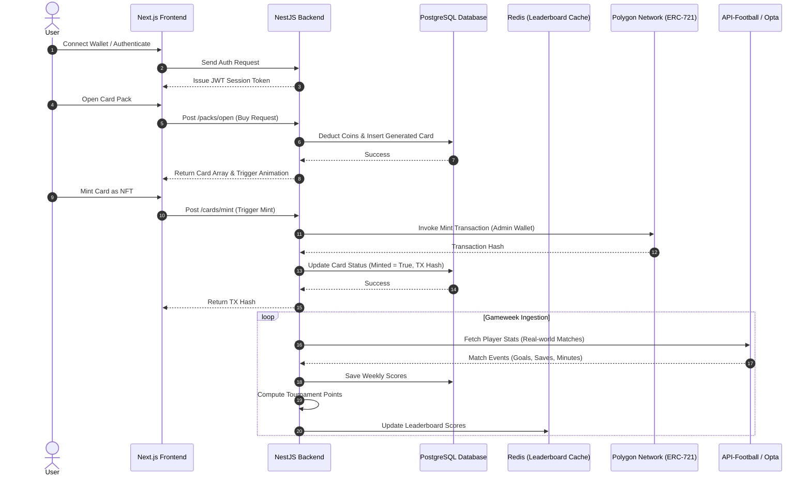

# Product Requirements Document (PRD)

**Project Name:** kickIt  
**Version:** 1.0  
**Owner:** Muhammad Izzdaniel  
**Last Updated:** 19 July 2026

---

# 1. Project Goal & Overview

The goal of **kickIt** is to build a web-based, mobile-responsive 5-a-side fantasy football platform where users collect digital football player cards, manage strategic rosters, and compete in tournaments against other players. The platform will operate on a hybrid model:
- **Off-chain Layer:** Primary gameplay, card collection management, pack opening, and database operations occur off-chain to ensure speed, ease of use, and a gas-free user experience.
- **On-chain Layer:** Optional Web3 integration on the Polygon blockchain enables users to mint their digital cards as ERC-721 NFTs. This grants players true ownership, allowing them to trade or sell assets on secondary markets like OpenSea.

---

# 2. System Architecture

The following diagram illustrates the interaction between the system's components, including the sports data ingestion, off-chain database, and Polygon blockchain smart contracts.



### Technology Stack Specifications
- **Frontend Framework:** Next.js (TypeScript) with Tailwind CSS for layouts and Framer Motion for premium card animations.
- **Backend Framework:** NestJS (TypeScript) utilizing TypeORM/Prisma for object-relational mapping.
- **Database:** PostgreSQL for transactional relational data.
- **Caching & Leaderboards:** Redis for high-speed gameweek leaderboard scoring and active session caching.
- **Web3 Integration:** Hardhat/Solidity for smart contracts, using `viem` or `ethers.js` on the backend to interact with the Polygon network.
- **Sports Data Provider:** API-Football or Opta API for ingestion of real-world football data.

---

# 3. Database Schema Design (PostgreSQL)

To guide backend implementation, here is the relational schema design detailing the core tables.

```sql
-- Enums
CREATE TYPE card_position AS ENUM ('GK', 'DEF', 'MID', 'FWD');
CREATE TYPE card_rarity AS ENUM ('COMMON', 'RARE', 'EPIC', 'LEGENDARY', 'MYTHIC');
CREATE TYPE listing_status AS ENUM ('ACTIVE', 'COMPLETED', 'CANCELLED');
CREATE TYPE gameweek_status AS ENUM ('UPCOMING', 'OPEN', 'LOCKED', 'COMPLETED');
CREATE TYPE currency_type AS ENUM ('COIN', 'GEM');

-- 1. Users Table
CREATE TABLE users (
    id UUID PRIMARY KEY DEFAULT gen_random_uuid(),
    email VARCHAR(255) UNIQUE NOT NULL,
    password_hash VARCHAR(255) NOT NULL,
    username VARCHAR(50) UNIQUE NOT NULL,
    wallet_address VARCHAR(42) UNIQUE,
    coins_balance INT DEFAULT 500 NOT NULL,
    gems_balance INT DEFAULT 0 NOT NULL,
    created_at TIMESTAMP WITH TIME ZONE DEFAULT CURRENT_TIMESTAMP,
    updated_at TIMESTAMP WITH TIME ZONE DEFAULT CURRENT_TIMESTAMP
);

-- 2. Player Cards Table (Inventory)
CREATE TABLE player_cards (
    id UUID PRIMARY KEY DEFAULT gen_random_uuid(),
    owner_id UUID REFERENCES users(id) ON DELETE SET NULL,
    player_name VARCHAR(100) NOT NULL,
    real_world_player_id INT NOT NULL, -- Reference ID of Sports API
    club VARCHAR(100) NOT NULL,
    league VARCHAR(100) NOT NULL,
    position card_position NOT NULL,
    ovr INT CHECK (ovr >= 40 AND ovr <= 99) NOT NULL,
    stat_att INT CHECK (stat_att >= 0 AND stat_att <= 99) NOT NULL,
    stat_def INT CHECK (stat_def >= 0 AND stat_def <= 99) NOT NULL,
    stat_pas INT CHECK (stat_pas >= 0 AND stat_pas <= 99) NOT NULL,
    stat_phy INT CHECK (stat_phy >= 0 AND stat_phy <= 99) NOT NULL,
    rarity card_rarity NOT NULL,
    season VARCHAR(9) NOT NULL, -- e.g., "2026/2027"
    serial_number INT NOT NULL,
    total_xp INT DEFAULT 0 NOT NULL,
    card_level INT DEFAULT 1 NOT NULL,
    is_minted BOOLEAN DEFAULT FALSE NOT NULL,
    nft_token_id VARCHAR(100),
    mint_tx_hash VARCHAR(66),
    created_at TIMESTAMP WITH TIME ZONE DEFAULT CURRENT_TIMESTAMP
);

-- 3. Gameweeks Table
CREATE TABLE gameweeks (
    id UUID PRIMARY KEY DEFAULT gen_random_uuid(),
    gw_number INT UNIQUE NOT NULL,
    status gameweek_status DEFAULT 'UPCOMING' NOT NULL,
    start_time TIMESTAMP WITH TIME ZONE NOT NULL,
    lock_time TIMESTAMP WITH TIME ZONE NOT NULL,
    end_time TIMESTAMP WITH TIME ZONE NOT NULL
);

-- 4. Squads Table
CREATE TABLE squads (
    id UUID PRIMARY KEY DEFAULT gen_random_uuid(),
    user_id UUID REFERENCES users(id) ON DELETE CASCADE,
    name VARCHAR(50) DEFAULT 'My Squad' NOT NULL,
    formation VARCHAR(10) NOT NULL, -- e.g., "1-2-1"
    gk_card_id UUID REFERENCES player_cards(id),
    def1_card_id UUID REFERENCES player_cards(id),
    def2_card_id UUID REFERENCES player_cards(id), -- Nullable if not in formation
    mid1_card_id UUID REFERENCES player_cards(id),
    mid2_card_id UUID REFERENCES player_cards(id), -- Nullable if not in formation
    fwd1_card_id UUID REFERENCES player_cards(id),
    fwd2_card_id UUID REFERENCES player_cards(id), -- Nullable if not in formation
    sub_gk_def_id UUID REFERENCES player_cards(id),
    sub_mid_fwd_id UUID REFERENCES player_cards(id),
    is_active BOOLEAN DEFAULT FALSE NOT NULL,
    created_at TIMESTAMP WITH TIME ZONE DEFAULT CURRENT_TIMESTAMP,
    updated_at TIMESTAMP WITH TIME ZONE DEFAULT CURRENT_TIMESTAMP
);

-- 5. Marketplace Listings Table
CREATE TABLE marketplace_listings (
    id UUID PRIMARY KEY DEFAULT gen_random_uuid(),
    card_id UUID REFERENCES player_cards(id) ON DELETE CASCADE,
    seller_id UUID REFERENCES users(id) ON DELETE CASCADE,
    buyer_id UUID REFERENCES users(id) ON DELETE SET NULL,
    price INT NOT NULL,
    currency currency_type NOT NULL,
    status listing_status DEFAULT 'ACTIVE' NOT NULL,
    created_at TIMESTAMP WITH TIME ZONE DEFAULT CURRENT_TIMESTAMP,
    updated_at TIMESTAMP WITH TIME ZONE DEFAULT CURRENT_TIMESTAMP
);

-- 6. Player Weekly Scores Table
CREATE TABLE player_weekly_scores (
    id UUID PRIMARY KEY DEFAULT gen_random_uuid(),
    real_world_player_id INT NOT NULL,
    gameweek_id UUID REFERENCES gameweeks(id) ON DELETE CASCADE,
    minutes_played INT DEFAULT 0 NOT NULL,
    goals INT DEFAULT 0 NOT NULL,
    assists INT DEFAULT 0 NOT NULL,
    yellow_cards INT DEFAULT 0 NOT NULL,
    red_cards INT DEFAULT 0 NOT NULL,
    own_goals INT DEFAULT 0 NOT NULL,
    penalty_misses INT DEFAULT 0 NOT NULL,
    clean_sheet BOOLEAN DEFAULT FALSE NOT NULL,
    saves INT DEFAULT 0 NOT NULL,
    penalty_saves INT DEFAULT 0 NOT NULL,
    total_points INT DEFAULT 0 NOT NULL,
    created_at TIMESTAMP WITH TIME ZONE DEFAULT CURRENT_TIMESTAMP
);

-- 7. Tournament Entries Table
CREATE TABLE tournament_entries (
    id UUID PRIMARY KEY DEFAULT gen_random_uuid(),
    user_id UUID REFERENCES users(id) ON DELETE CASCADE,
    squad_id UUID REFERENCES squads(id) ON DELETE CASCADE,
    gameweek_id UUID REFERENCES gameweeks(id) ON DELETE CASCADE,
    total_score INT DEFAULT 0 NOT NULL,
    rank INT,
    created_at TIMESTAMP WITH TIME ZONE DEFAULT CURRENT_TIMESTAMP,
    UNIQUE (user_id, gameweek_id)
);
```

---

# 4. MVP Feature Specifications

---

## Feature 1 - Authentication
- **Description:** Secure onboarding and session management for users.
- **User Story:** As a user, I want to sign up with my email/password and log in, so I can access my profile and squad.
- **Functional Requirements:**
  - Standard email/password registration with schema validation.
  - Password hashing with bcrypt.
  - Issue JWT access tokens stored in secure, HTTP-only cookie.
  - Endpoint `POST /auth/register` and `POST /auth/login`.
- **Acceptance Criteria:**
  - Users cannot sign up with an existing email.
  - Password strength requires min 8 characters, 1 number, 1 uppercase.
  - Protected API routes block requests lacking valid JWTs.
- **Edge Cases & Error Handling:**
  - *Rate Limiting:* Limit login attempts to 5 per IP address per 15 minutes. Respond with HTTP 429.

---

## Feature 2 - Dashboard
- **Description:** The homepage showing active stats, inventory totals, and current tournament status.
- **User Story:** As a user, I want to load the dashboard to immediately see my currency balances, active squad summary, and active tournament progress.
- **Functional Requirements:**
  - Retrieve user stats: coins, gems, card counts.
  - Fetch active gameweek countdown timer and user's current ranking placement.
  - Endpoint `GET /user/dashboard`.
- **Acceptance Criteria:**
  - Page loads under 2 seconds.
  - Data updates automatically upon returning focus to the browser window.

---

## Feature 3 - Card Collection
- **Description:** A library showcasing all cards owned by the player, supporting filters, search, and Web3 minting.
- **User Story:** As a user, I want to filter and search my collection, and select cards to bridge onto the blockchain.
- **Functional Requirements:**
  - Search by player name, filter by position, club, rating, and rarity.
  - Pagination (default 24 cards per page).
  - Trigger blockchain minting of a card by verifying connected MetaMask wallet address and initiating backend transactions via Polygon RPC nodes.
  - Endpoints: `GET /cards`, `POST /cards/mint/:id`.
- **Acceptance Criteria:**
  - Minting updates the card state to `is_minted = true` and saves the transaction hash on success.
- **Edge Cases & Error Handling:**
  - *Congested Blockchain:* If the Polygon network is congested, cache the pending minting transaction, show a "Pending Mint" state in the UI, and listen to transaction events via a cron job to confirm.

---

## Feature 4 - Pack Opening
- **Description:** The gacha mechanic allowing users to buy card booster packs.
- **User Story:** As a user, I want to spend Coins or Gems to purchase packs and watch an engaging card reveal animation.
- **Functional Requirements:**
  - Deduct currency safely within a DB transaction to prevent double spending.
  - Generate 5 random cards based on rarity weights.
  - Save cards to `player_cards` table.
  - Endpoint: `POST /packs/open`.
- **Acceptance Criteria:**
  - Users cannot buy packs if their balance is insufficient.
  - Rarity percentages match GDD definitions: 70% Common, 20% Rare, 7% Epic, 2.5% Legendary, 0.5% Mythic.
- **Edge Cases & Error Handling:**
  - *Network Drop Mid-Opening:* If the request is interrupted after database deduction but before the animation loads, the cards are already saved to the database. The user can view them in their collection.

---

## Feature 5 - Marketplace
- **Description:** P2P marketplace for trading cards.
- **User Story:** As a user, I want to list my cards for sale or purchase listed cards to build my ideal team.
- **Functional Requirements:**
  - List cards for Coins or Gems. Listing locks the card from being added to squads or upgraded.
  - Purchase card: transfers owner, shifts currency, applies 5% tax sink, unlocks card.
  - Endpoints: `POST /marketplace/listings`, `POST /marketplace/buy/:id`, `DELETE /marketplace/listings/:id`.
- **Acceptance Criteria:**
  - A user cannot purchase their own listing.
  - Transaction must be atomic. Database lock `SELECT FOR UPDATE` is applied during purchase execution.
- **Edge Cases & Error Handling:**
  - *Double Buy:* If two users buy the same card simultaneously, the first write lock succeeds, and the second user receives an HTTP 400 "Listing already sold".

---

## Feature 6 - Squad Builder
- **Description:** Visual squad assembly manager with validation checking.
- **User Story:** As a user, I want to assign cards to positional slots to save my team structure.
- **Functional Requirements:**
  - Select 5 starters + 2 substitutes.
  - Validation: Ensure 1 GK slot contains a Goalkeeper card, etc.
  - Validation: Sum of OVR ratings of the starters must not exceed the active league cap.
  - Endpoint: `POST /squads/save`.
- **Acceptance Criteria:**
  - Invalid squad configurations are rejected on the backend.
- **Edge Cases & Error Handling:**
  - *Post-Lock changes:* Reject requests with HTTP 403 if user attempts to save changes after the active gameweek lock time.

---

## Feature 7 - Tournament & Leaderboard
- **Description:** Compete weekly and view global rankings.
- **User Story:** As a user, I want to enter my squad into weekly tournaments and see where I rank on the leaderboard.
- **Functional Requirements:**
  - Auto-enroll active squads in tournaments.
  - Compute scores post-gameweek.
  - Cache current leaderboards in Redis Sorted Sets (`ZADD`).
  - Endpoints: `GET /leaderboards/:gameweekId`.
- **Acceptance Criteria:**
  - Leaderboard loads dynamically with pagination support.

---

# 5. Non-Functional Requirements

### Performance
- Target API response times below **150ms** for 95% of requests.
- Page Load Time: Under 2.0 seconds globally, optimized via Next.js server-side caching and dynamic layouts.
- Asset Delivery: Host card images on CDN to ensure global asset load speed.

### Security
- Store JWT tokens in secure, HTTP-only, SameSite=Strict cookies to protect against XSS/CSRF.
- Password storage must utilize `bcrypt` with a minimum cost factor of 10.
- Implement rate limiting (NestJS Throttler) restricting users to 100 API requests per minute.
- Standard smart contracts should use tested OpenZeppelin standards.

### Scalability
- Create database indexes on foreign keys (`owner_id`, `card_id`, `seller_id`) and lookup fields (`real_world_player_id`, `gameweek_id`).
- High-traffic scoreboard endpoints must read directly from Redis.

---

# 6. Milestones & Deliverables

```
+-------------------------------------------------------------------------------+
|                                                                               |
|  MILESTONE 1: Foundation (Weeks 1-2)                                          |
|  - PostgreSQL Database configuration and Table schemas deployment.            |
|  - NestJS API core structure setup & Auth module (JWT, validation).           |
|  - Dashboard frontend layout with Next.js & authentication page.              |
|                                                                               |
+--------------------------------------|----------------------------------------+
                                       |
                                       v
+-------------------------------------------------------------------------------+
|                                                                               |
|  MILESTONE 2: Gameplay Core (Weeks 3-4)                                       |
|  - Card database entities and random pack generation algorithm.               |
|  - Marketplace transaction service (locking logic, fee system).               |
|  - Squad builder interface with positional filters and rating validations.     |
|                                                                               |
+--------------------------------------|----------------------------------------+
                                       |
                                       v
+-------------------------------------------------------------------------------+
|                                                                               |
|  MILESTONE 3: Gameweek Loop (Weeks 5-6)                                       |
|  - Data pipeline script to consume Sports APIs and map metrics to points.     |
|  - Redis leaderboard caching.                                                 |
|  - Automatic gameweek scheduler (Open -> Lock -> Settlement loops).           |
|                                                                               |
+--------------------------------------|----------------------------------------+
                                       |
                                       v
+-------------------------------------------------------------------------------+
|                                                                               |
|  MILESTONE 4: Web3 & Launch (Weeks 7-8)                                       |
|  - Smart Contracts (ERC-721) deployment on Polygon testnet.                   |
|  - MetaMask wallet connection handler in Frontend.                            |
|  - Backend minting listener and transaction status monitors.                 |
|                                                                               |
+-------------------------------------------------------------------------------+
```

---

# 7. Risks & Mitigation Plan

- **Sports Data Inconsistency:**
  - *Risk:* API provider experiences outages or delivers incorrect data, delaying leaderboard calculations.
  - *Mitigation:* Cache recent matches; design manual verification override panel in backend admin dashboard to allow adjustments.
- **Gas Costs on Polygon:**
  - *Risk:* High activity on Polygon leads to elevated gas fees for card minting.
  - *Mitigation:* Implement Lazy Minting (cards remain off-chain until a user chooses to pay gas fee to mint it to their wallet).
- **Player License & Copyrights:**
  - *Risk:* Real player names and imagery invite licensing disputes.
  - *Mitigation:* Launch prototype with open license metrics and stylized, artistic player representations rather than copyrighted photos.